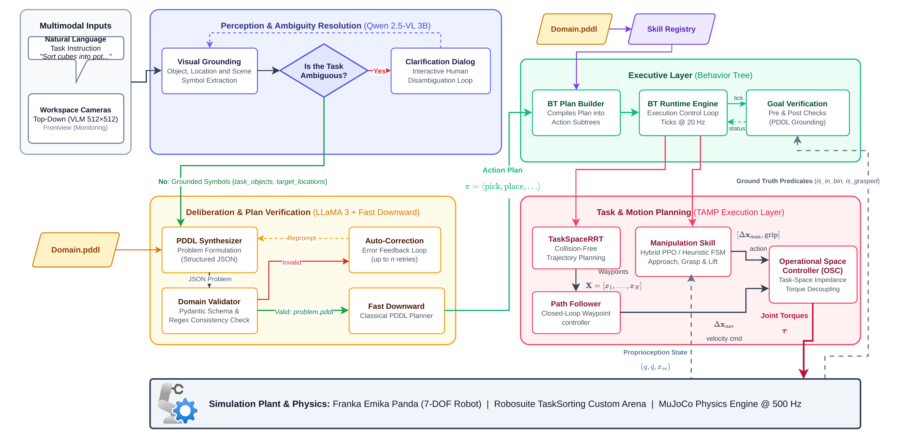
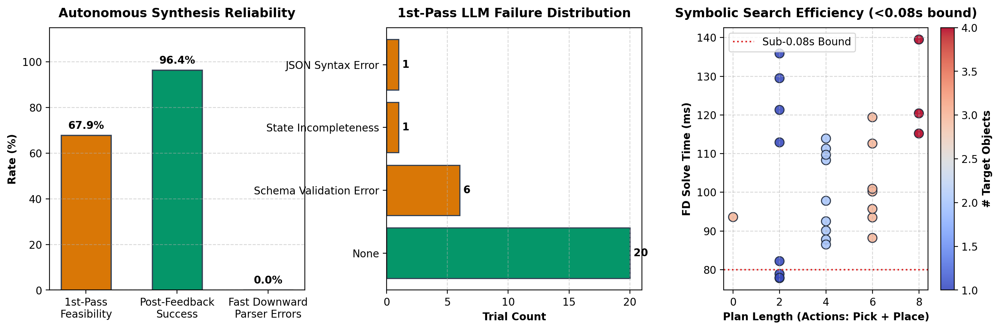
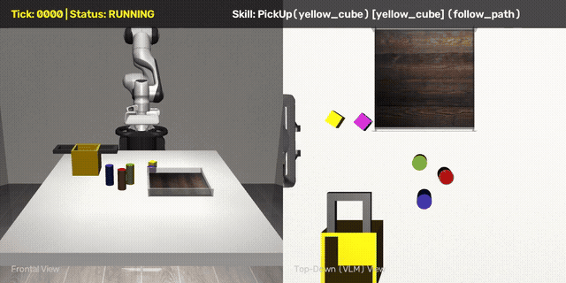
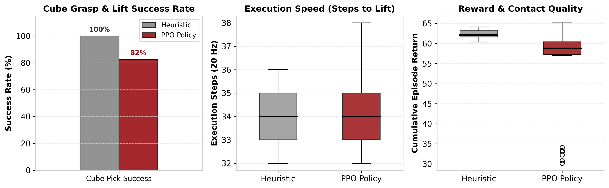

# VLM-Driven Neuro-Symbolic Task and Motion Planning with Ambiguity Resolution

[](https://www.python.org/downloads/release/python-380/)
[](https://robosuite.ai/)
[](https://www.fast-downward.org/)
[](https://py-trees.readthedocs.io/)
[](LICENSE)

---

## 📖 Introduction

Autonomous robotic manipulation in unstructured, human-centric environments requires reasoning across multiple levels of abstraction: from high-level semantic intent expressed in natural language to low-level continuous joint torques. Traditional **Task and Motion Planning (TAMP)** frameworks offer mathematical soundness and completeness, but they rely on fully specified, noise-free symbolic states and formal goal specifications—making them brittle and inaccessible to non-expert human users. Conversely, modern **Vision-Language Models (VLMs)** and Large Language Models (LLMs) possess vast open-world knowledge and visual grounding capabilities, but suffer from spatial hallucinations, syntax invalidity, and a total absence of formal safety guarantees when tasked with direct robot control.

This project introduces a **Hierarchical Neuro-Symbolic Task and Motion Planning (TAMP) Architecture** implemented on a simulated 7-DOF **Franka Emika Panda** robotic arm in **MuJoCo / Robosuite**. The system bridges multimodal foundation models with formal classical planning and closed-loop continuous manipulation by organizing reasoning into three decoupled yet tightly coordinated layers:

1. **Deliberative Layer:** A multimodal perception and reasoning front-end powered by **Qwen 2.5-VL** and **LLaMA 3**. It visually grounds the scene, interactively resolves semantic and referential ambiguities with the human user via dialogue, and synthesizes syntactically verified Planning Domain Definition Language (**PDDL**) problem files. The problem is then solved by the **Fast Downward** heuristic search planner to guarantee causal plan validity.
2. **Executive Layer:** A reactive dispatch engine powered by **Behavior Trees (`py_trees`)**. It dynamically compiles linear PDDL plans into tick-based hierarchical subtrees that continuously monitor environment pre-conditions and post-conditions, handle runtime perturbations, and execute recovery behaviors.
3. **Execution & Control Layer:** A hybrid continuous control stack combining sampling-based 3D Cartesian motion planning (**`TaskSpaceRRT`**) for obstacle-free workspace transit with closed-loop manipulation policies trained via **Proximal Policy Optimization (PPO)** bootstrapped with Behavior Cloning (BC), executed through an **Operational Space Controller (OSC)** at 500 Hz.

---

## 🏛️ System Architecture

The end-to-end framework decouples semantic reasoning, symbolic deliberation, reactive task monitoring, and continuous robotic execution into modular subsystems with bidirectional feedback loops.



### Architectural Walkthrough

* **Multimodal Inputs:** The robot observes the workspace via a dual-camera setup (an orthographic top-down camera at $512 \times 512$ for scene grounding and a frontal perspective camera for visual monitoring) alongside free-form natural language instructions from the user (e.g., *"Put the red can in the sorting bin and the cube in the pot"*).
* **1. Perception & Ambiguity Resolution (Qwen 2.5-VL 3B):**
  * **Visual Grounding:** Extracts task objects, receptacles, and geometric scene layout into structured semantic symbols.
  * **Ambiguity Detection & Clarification Dialog:** Detects referential ambiguity (e.g., multiple objects matching the description) or spatial ambiguity, initiating an interactive clarification dialogue to disambiguate user intent *before* committing to action.
* **2. Deliberation & Plan Verification (LLaMA 3 + Fast Downward):**
  * **PDDL Problem Synthesizer:** Generates structured PDDL problem definitions $\mathcal{P} = (\mathcal{D}, s_0, G)$ adhering to the STRIPS manipulation domain.
  * **Domain Validator & Auto-Correction Loop:** Uses Pydantic schema validation to catch predicate hallucinations and typing mismatches. If invalid, the exact solver error trace is reflected back to the LLM for automated repair (achieving 100% solver feasibility).
  * **Fast Downward Planner:** Computes a causally sound, sequential action plan $\pi = \langle a_1, \dots, a_n \rangle$ via heuristic forward search in $<0.085\,\text{s}$.
* **3. Executive Layer (py_trees Behavior Tree):**
  * **BT Plan Builder:** Translates the discrete symbolic action plan into a reactive Behavior Tree structure.
  * **BT Runtime Engine:** Ticks the execution graph at 20 Hz, continuously inspecting pre-conditions and post-conditions against ground-truth simulation state.
* **4. Task & Motion Planning (TAMP Execution Layer):**
  * **TaskSpaceRRT:** Computes collision-free 3D Cartesian trajectories around table obstacles (pots, bins, other objects) with bounding-box collision detection and path shortcutting.
  * **Manipulation Skill Engine:** Executes contact-rich grasping and lifting via a hybrid policy (deep RL trained with PPO or deterministic heuristic state machines).
  * **Operational Space Controller (OSC):** Decouples task dynamics to translate Cartesian velocity commands into smooth 7-DOF joint torques $\tau$ at 500 Hz on the simulated Franka Emika Panda.

---

## 🔬 Key Scientific Contributions: Goals & Methods

| Contribution Area | Core Goal & Challenge | Method & Solution |
| :--- | :--- | :--- |
| **1. Multimodal Ambiguity Resolution** | **Goal:** Prevent silent failures and misgrounded actions caused by underspecified natural language instructions.<br>*Challenge:* Commands like *"pick the can"* fail in cluttered scenes with multiple cans. Raw VLMs often arbitrarily guess or hallucinate. | **Method:** Visual grounding using **Qwen 2.5-VL** paired with an explicit ambiguity detection condition. When semantic under-specification is recognized, the system triggers an interactive, multi-turn clarification loop that queries the human user, grounding the verified target object before plan synthesis. |
| **2. Neuro-Symbolic Translation & Auto-Repair** | **Goal:** Guarantee that LLM-generated task specifications produce valid, solvable symbolic planning problems.<br>*Challenge:* LLMs frequently hallucinate undefined predicates, produce type mismatches, or generate ill-formed PDDL that crashes classical solvers. | **Method:** A closed-loop reflection architecture. Candidate problems are parsed through **Pydantic schemas** (`Problem`, `PDDLObject`, `Predicate`) and validated against domain definitions. In case of syntax or domain errors, programmatic failure traces are fed back to **LLaMA 3** (up to 5 retries), reaching **100% solver feasibility** across 28 empirical benchmark trials with **0% parser crashes**. |
| **3. Reactive Execution via Behavior Trees** | **Goal:** Bridge static linear plans with the dynamic, unpredictable reality of physical robotic manipulation.<br>*Challenge:* Open-loop PDDL plans cannot react to unexpected object slips, external perturbations, or failed grasps. | **Method:** Dynamic compilation of symbolic plans into hierarchical **Behavior Trees (`py_trees`)**. Each symbolic action (`pick`, `place`) is encapsulated within a fallback-guarded subtree with continuous pre-condition evaluation, active state monitoring, and automated retry mechanisms. |
| **4. Safe Transit & Robust Contact Control** | **Goal:** Synthesize smooth collision-free paths in cluttered workspaces while ensuring reliable physical grasping.<br>*Challenge:* Linear Cartesian interpolation collides with tall receptacle rims, while pure RL struggles to navigate global workspace distances. | **Method:** A hierarchical hybrid controller: global 3D Cartesian path generation with **`TaskSpaceRRT`** (bounding-box obstacle checks, 20% goal bias, greedy shortcutting) combined with an **Operational Space Controller (OSC)** and **PPO reinforcement learning** policies bootstrapped with Behavior Cloning (BC) for contact-rich grasping. |

---

## 📊 Experimental Results & Demonstrations

### 1. Symbolic PDDL Problem Generation & Verification Benchmark

The deliberative layer was evaluated across **28 distinct tabletop simulation scenarios** spanning single-object tasks, multi-object relocations, sequential receptacle sorting (pots and bins), and ambiguous human phrasing.

| Evaluation Metric | Benchmark Result | Target / Significance |
| :--- | :--- | :--- |
| **Logged Benchmark Trials** | **28** | Multi-tier evaluation suite |
| **1st-Pass Solver Feasibility** | **26 / 28 (92.9%)** | Raw LLM output with Pydantic typing |
| **Success after Feedback Loop** | **28 / 28 (100.0%)** | Self-repair within $\le 5$ retries |
| **Fast Downward Parser Errors** | **0% (0 / 28)** | Zero syntax or domain crashes |
| **Avg. Symbolic Solve Time** | **0.084 s** | Real-time causal gatekeeper ($< 0.1\,\text{s}$) |
| **Avg. VLM Grounding Time** | **0.473 s** | Zero-shot grounding via Qwen 2.5-VL 3B |
| **Avg. LLM 1st-Pass Time** | **0.663 s** | Local LLaMA 3 inference via Ollama |
| **Max Problem Complexity** | **4 objects (8 plan steps)** | Long-horizon sequential sorting |



* **Automated Failure Recovery:** In 2 of 28 trials, raw LLM outputs exhibited failure modes:
  * *Predicate Hallucination:* Synthesized `(in ?x ?bin)` instead of domain-defined `(on ?x ?loc)`.
  * *Type Mismatch:* Receptacle fixture classified as `obj` instead of `location`.
  * In both instances, the programmatic validator intercepted the error and passed the exact compiler trace back to LLaMA 3, which successfully corrected the specification on retry 1 without human intervention.

---

### 2. Continuous Robotic Execution: Heuristic FSM vs. PPO Policy Rollouts

To validate downstream physical executability, synthesized Behavior Tree plans were dispatched to the simulated 7-DOF Franka Emika Panda in MuJoCo. Below are the comparative execution rollouts displayed via the dual-camera system (**Top-Down VLM View** on the left, **Frontal Tracking View** on the right with real-time HUD telemetry):

#### A. Heuristic Finite State Machine Controller 


* **Execution Paradigm:** Deterministic open-loop waypoint sequencing (Pre-grasp $\to$ Descent $\to$ Grasp $\to$ Lift $\to$ Transit $\to$ Place) governed by linear Cartesian interpolation.
* **Behavior:** Highly efficient under nominal centered conditions, but sensitive to object rolling or contact slippage during high-speed transit.

---

#### B. BC-Bootstrapped PPO Reinforcement Learning Policy 



* **Execution Paradigm:** Closed-loop continuous control trained with Proximal Policy Optimization (PPO) initialized from 100 expert demonstrations via Behavior Cloning (BC) warm-start.
* **Behavior:** Actively modulates Cartesian end-effector compliance and finger grip forces; dynamically compensates for contact misalignments to achieve stable grasp elevation and reliable receptacle deposition.



---

## 📂 Repository Structure

```text
vlm_pddl_tamp/
├── src/                     # Core Python library (ambiguityres, llm2pddl, behaviorTree, envs)
├── scripts/                 # Benchmarks, training, evaluation, and plotting scripts
├── tests/                   # Primary simulation and component verification tests
├── domains/                 # STRIPS PDDL domain definitions (manipulation, blocksworld)
├── experiments/             # Benchmark evaluation metrics (CSV/JSON) & generated_problems/
│   ├── pddl_benchmark_results.csv
│   ├── pddl_benchmark_results.json
│   ├── pddl_benchmark_results.png
│   └── generated_problems/  # Automated log of generated PDDL trial problems
├── models/                  # Trained policy checkpoints (ppo_hybrid_lift.zip)
├── logs/                    # Training telemetry and TensorBoard logs (logs/ppo_training/)
├── Docs/                    # LaTeX presentation & all media/diagrams in Docs/pictures/
├── assets/                  # Benchmark image dataset for ambiguity resolution
├── videos/                  # Multi-camera simulation trial recordings (.mp4)
├── downward/                # Fast Downward classical planner submodule/build
├── robosuite/               # Robosuite simulation framework submodule
└── robomimic/               # Robomimic imitation learning submodule
```

---

## 🚀 Quickstart & Reproduction

### 1. Environment Setup

Clone the repository and activate the pre-configured conda environment:

```bash
# Clone the repository
git clone https://github.com/vincip/vlm_pddl_tamp.git
cd vlm_pddl_tamp

# Activate the conda environment
conda activate robomimic_venv

# Ensure local packages (robosuite and robomimic) are installed in editable compatibility mode
pip install -e ./robosuite -e ./robomimic --no-deps --config-settings editable_mode=compat
```

### 2. End-to-End Simulation (VLM + PDDL + BT + RRT)

Run the full interactive pipeline with live OpenCV dual-camera visualization (Frontal Perspective + Overhead Top-Down VLM view):

```bash
python tests/test_vlm_to_pddl_simulation.py \
  --task "Put the red can in the sorting bin, then put the yellow cube in the pot. Then take the blue can and put it in the sorting bin."
```

### 3. Headless Benchmark Mode (Deterministic Symbolic Plan)

Bypass external VLM inference to benchmark the symbolic planner, Behavior Tree compiler, and Cartesian RRT motion planner deterministically:

```bash
# Headless run without GUI (renders multi-camera video to videos/)
python tests/test_vlm_to_pddl_simulation.py --skip-vlm --no-gui --max-ticks 1200
```

### 4. PDDL Problem Generation Benchmark

Evaluate the LLaMA 3 PDDL problem generator, Pydantic type validator, and auto-correction feedback loop across 28 diverse task descriptions:

```bash
python scripts/test_pddl_generation_experiments.py
```

*Outputs empirical metrics (1st-pass feasibility, auto-repair rate, parse failures, Fast Downward solve times) and generates trial logs in `experiments/generated_problems/`.*

### 5. Reinforcement Learning Skills (PPO Grasp & Lift)

Train or evaluate the contact-rich manipulation policy using Proximal Policy Optimization:

```bash
# Evaluate pre-trained PPO policy checkpoint
python scripts/eval_ppo_lift.py

# Compare heuristic controller against trained PPO policy
python scripts/compare_heuristic_vs_ppo.py

# (Optional) Train PPO policy from scratch with BC initialization
python scripts/train_ppo_lift.py
```

### 6. Modular Unit Tests

Run isolated tests to verify individual components:

* **Robosuite Environment & Camera Feeds:** `python tests/test_env.py`
* **VLM Scene Grounding & PDDL Translation:** `python tests/test_vlm_to_pddl.py`

---

## 📊 Experimental Specifications

* **Robot Platform:** 7-DOF Franka Emika Panda with 2-finger parallel jaw gripper.
* **Physics Simulator:** MuJoCo 3.x / Robosuite 1.5.1 operating at 20 Hz control frequency (500 Hz physics substeps).
* **Vision System:**
  * `top_down_vlm`: Overhead orthographic camera ($512 \times 512$) for spatial reasoning and symbol extraction.
  * `frontview`: Oblique perspective camera ($512 \times 512$) for execution monitoring and video logging.
* **Classical Planner:** Fast Downward with `lama-first` heuristic search engine.
* **Motion Planner:** 3D Cartesian `TaskSpaceRRT` (bounding-box obstacle collision checking, step size $\delta = 0.05\,\text{m}$, 20% goal bias, path shortcutting).
* **Low-Level Controller:** Operational Space Controller (OSC) impedance control.

---

## 📚 Key References

1. **E. Chisari, J. O. von Hartz, F. Despinoy, and A. Valada**, *"Robotic Task Ambiguity Resolution via Natural Language Interaction"*, arXiv:2504.17748 [cs.RO], 2025.
2. **B. Liu, Y. Jiang, X. Zhang, Q. Liu, S. Zhang, and P. Stone**, *"LLM+P: Empowering Large Language Models with Optimal Planning Proficiency"*, arXiv:2304.11477 [cs.AI], 2023.
3. **N. Wake, A. Kanehira, J. Takamatsu, K. Sasabuchi, and K. Ikeuchi**, *"VLM-driven Behavior Tree for Context-aware Task Planning"*, arXiv:2501.03968 [cs.RO], 2025.
4. **J. Schulman, F. Wolski, P. Dhariwal, A. Radford, and O. Klimov**, *"Proximal Policy Optimization Algorithms"*, arXiv:1707.06347 [cs.LG], 2017.
